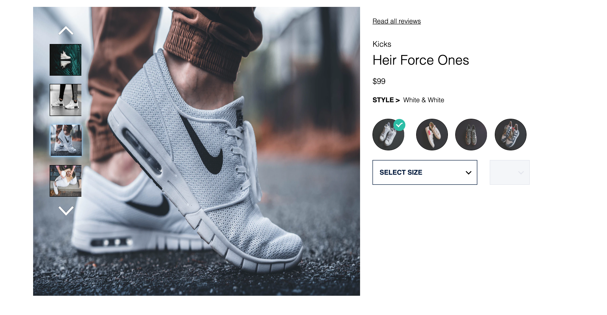
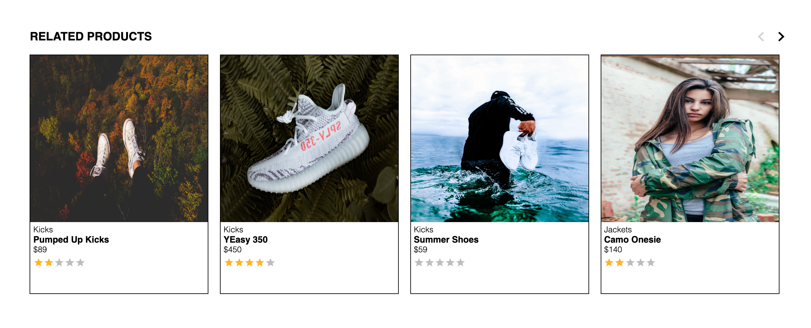
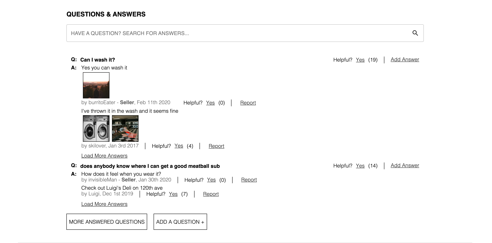
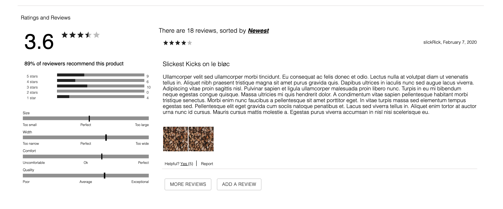

# Exact Science Apparel
---






> General product overview page, consisting of a related products section, a dedicated module to user-provided questions and answers, and a ratings and reviews module.
## Table of Contents
- [Description](#description)
- [Instructions](#instructions)
- [Resources](#resources)
- [Author Info](#author-info)

---

## Description


#### Technologies

- React
- React Router
- SCSS
- MaterialUI

## Instructions

Install the project's dependencies

```npm install```

In order to run the project in an browser simulator, run:

```npm start```

## Resources

Various resources used here

## Author Info

This project was created by the following contributors:

Bailey Theriault
  - GitHub - https://github.com/baileytheriault
  - LinkedIn - https://www.linkedin.com/in/baileytheriault/

Brian Bouchard
  - GitHub - https://github.com/bee-squared
  - LinkedIn - https://www.linkedin.com/in/brian-bouchard/

Daniel Jordan
  - Portfolio - https://www.danielmjordan.com
  - GitHub - https://github.com/danielmjordan
  - LinkedIn - https://www.linkedin.com/in/danielmjordan


